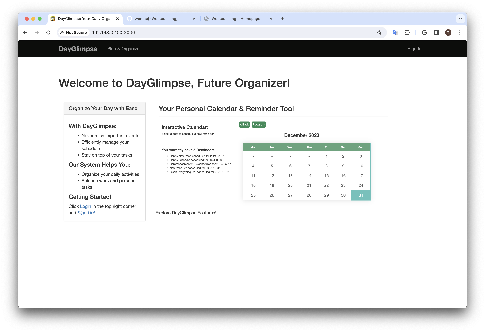
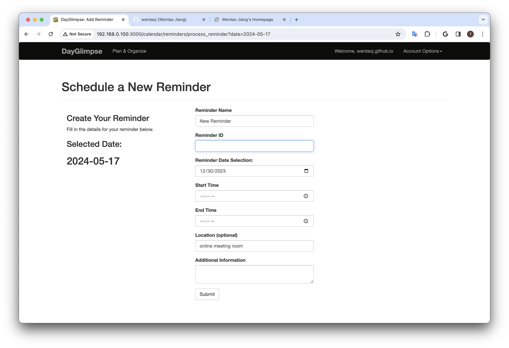
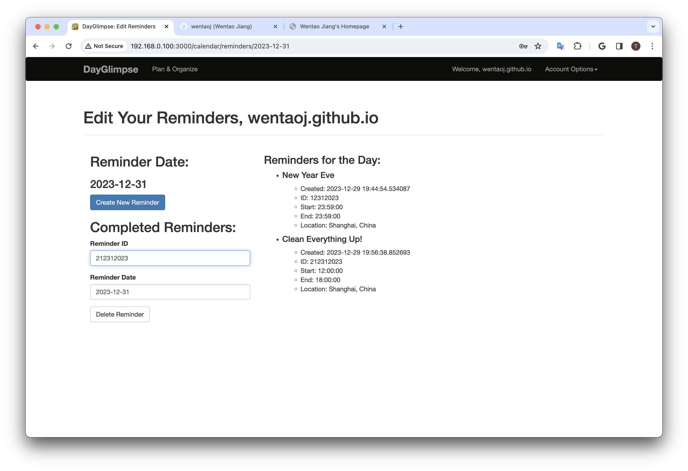
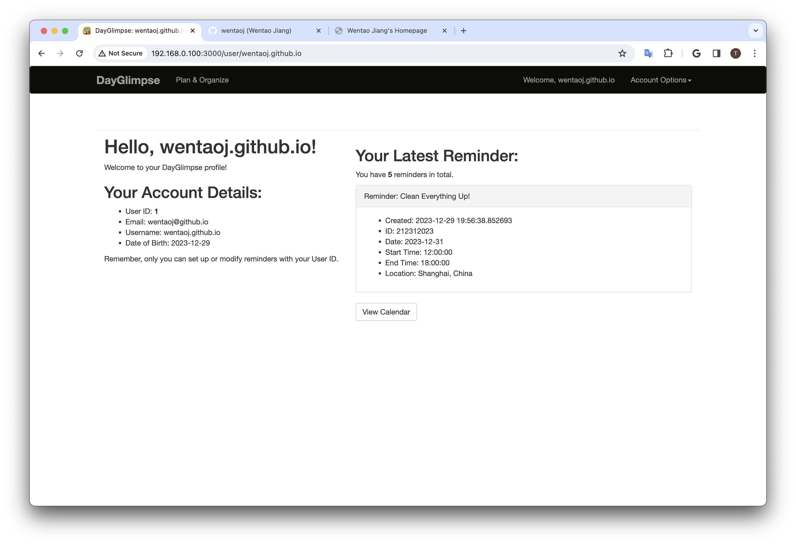
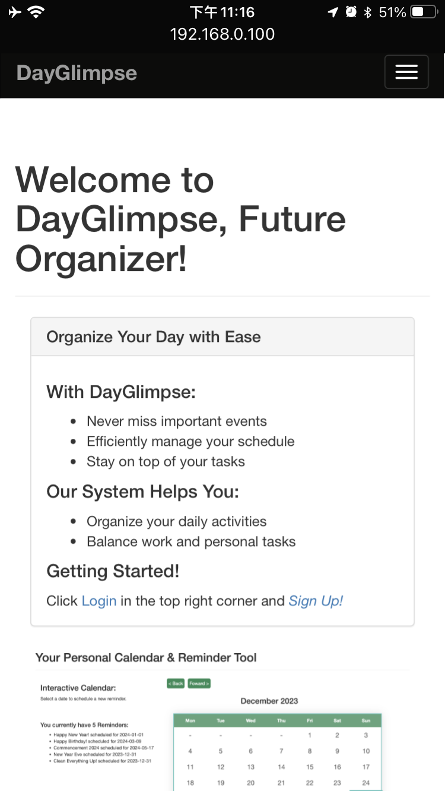
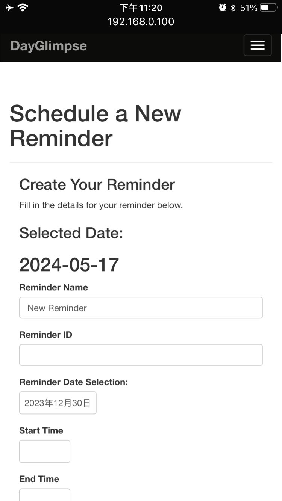
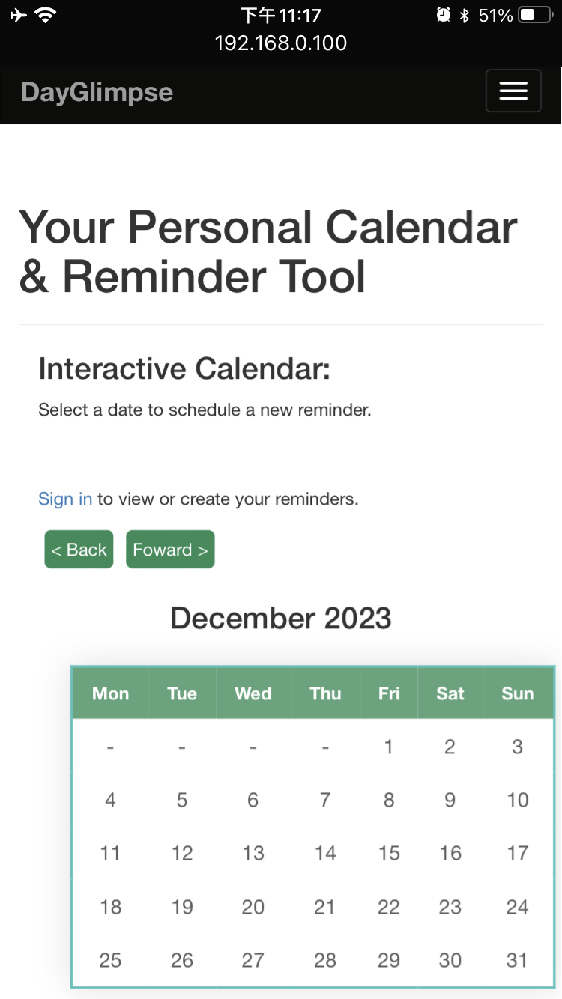
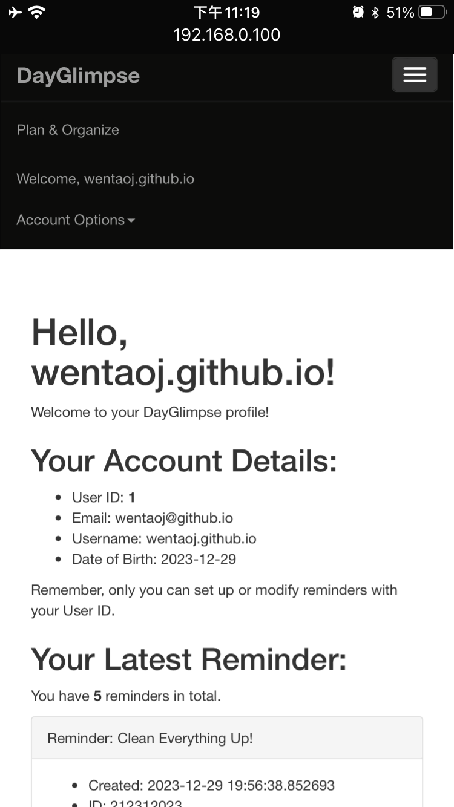

# DayGlimpse: Your Personal Reminder and Calendar Web App


## Project Information
#### Author: Wentao Jiang
#### Release Date: Apr.27, 2023
_Last Edit: Dec.29, 2023_

## Project Overview
**"DayGlimpse"** is a dynamic Flask Web Application designed to streamline and enhance daily scheduling and task management. It features user-friendly authentication, an interactive calendar, and efficient reminder management. The application encompasses the following key features:

- **User Authentication**: 
  - Secure user account management with session handling and password hashing.
- **Reminder Management**: 
  - Intuitive interface for creating, editing, and organizing reminders through dashboards.
- **Dynamic Calendar**: 
  - Interactive, AJAX-enabled calendar for real-time task tracking and reminder management.
- **Responsive Design**: 
  - A mobile-responsive layout optimized for various screen sizes using Bootstrap and CSS media queries.
- **Database Design**: 
  - SQLAlchemy for Object-Relational Mapping (ORM) and Alembic for Database Schema Versioning.

## Screenshots and Demo
#### Desktop View:
<div style="display: grid; grid-template-columns: repeat(2, 1fr); gap: 20px; max-width: 80%;">
  
  
  
  
</div>

Explore additional interfaces and features in Desktop View with comprehensive collection in [`./demo`](./demo/) directory.

#### Mobile View:
<div style="display: grid; grid-template-columns: repeat(2, 1fr); gap: 20px; max-width: 80%;">
  
  
  
  
</div>

Discover more about the mobile user experience with detailed Mobile View demos in [`./demo`](./demo/) directory.

## Development Environment
- **Deployment Environment**: Ubuntu 22.04.3 LTS (5.15.0-79-generic x86_64 GNU/Linux)
- **Web Framework**: Flask 3.0.0
- **Database**: SQLite Version 3 (via Flask-SQLAlchemy 3.1.1)
- **Python Version**: 3.11.5 [GCC 11.2.0] on linux
- **Package Management**: Conda 23.11.0, pip 23.3.1
- **Libraries**: Flask, Flask-SQLAlchemy, Werkzeug (full list in [`requirements.txt`](./requirements.txt))
- **Test Devices**: Tested on 13-inch MacBook Air (M2) and iPhone 8, with optimizations for small screens.

## Installation Instructions
1. Clone this repository to your local machine.
2. Check your current Python version with `python --version`. If not installed, download it from [Python](https://www.python.org/downloads/).
3. Navigate to the project directory and install the required dependencies by running `pip install -r requirements.txt`.
4. Change to the Flask app directory and configure the environment:
   ```bash
   $ cd ./flasky/
   $ export FLASK_APP=flasky.py
   ```
5. Initialize the Database:
   ```bash
   $ flask shell
   >>> from flasky import db
   >>> db.drop_all()
   >>> db.create_all()
   >>> quit()
   ```
6. Run the Application: 
   Start the Flask server. If port 5000 is occupied (e.g., by AirDrop on macOS), specify another port:
   ```bash
   $ flask run
   # or specify host and port
   $ flask run --host 0.0.0.0 --port 3000
   ```
7. Follow the URL link shown on the terminal. The default URL is `http://localhost:5000/`.

## Copyright Info
- **Application Developed by**:
  - &copy; 2023 [**Wentao Jiang**](https://wentaoj.github.io)
- **App Genre**: 
  - Utility
- **Visual Design**:
  - Icons and imagery designed by [Wentao Jiang](https://wentaoj.github.io/portfolio), further refined and generated using AI tools. ICO file generated using Pillow (PIL).
- **License**:
  - This project is licensed under the [MIT License](./LICENSE). Full license text is available in the repository.
- **Acknowledgments**: 
  - Special thanks to the developers and maintainers of Flask, Flask-SQLAlchemy, Werkzeug, [Flask Documentation (3.0.x)](https://flask.palletsprojects.com/en/3.0.x/), and other tools used in this project.
  - Special acknowledgment to Miguel Grinberg, the author of ["Flask Web Development, 2nd Edition"](https://www.oreilly.com/library/view/flask-web-development/9781491991725/).

## Appendix
### Database Schema Information:
This section outlines the structure of the `User` and `Reminder` tables in the "DayGlimpse" database.
#### User Table:
| uid      | username          | email             | dob        | password_hash           |
|----------|-------------------|-------------------|------------|-------------------------|
| 1        | wentaoj.github.io | wentaoj@github.io | 2023-12-29 | pbkdf2:sha256:...[hash] |
| 19700101 | hello.world       | hello@world.net   | 2023-12-29 | pbkdf2:sha256:...[hash] |
#### Reminder Table:
| note_name          | create_time                | note_id   | user_id  | note_loc            | note_set_date | date_start_hour | date_end_hour |
|--------------------|----------------------------|-----------|----------|---------------------|---------------|-----------------|---------------|
| Happy New Year!    | 2023-12-29 22:03:38.013922 | 1012024   | 1        | Shanghai, China     | 2024-01-01    | 00:00:00        | 23:59:00      |
| New Reminder       | 2023-12-29 20:03:51.752115 | 1112024   | 19700101 | online meeting room | 2023-12-30    | 00:00:00        | 23:59:00      |
| Happy Birthday!    | 2023-12-29 19:54:47.230134 | 3092024   | 1        | Rochester, NY       | 2024-03-09    | 00:00:00        | 23:59:00      |
| Commencement 2024  | 2023-12-29 20:00:16.848240 | 5172024   | 1        | Rochester, NY       | 2024-05-17    | 09:00:00        | 15:00:00      |
| New Year Eve       | 2023-12-29 19:44:54.534087 | 12312023  | 1        | Shanghai, China     | 2023-12-31    | 23:59:00        | 23:59:00      |
| Clean Everything Up| 2023-12-29 19:56:38.852693 | 212312023 | 1        | Shanghai, China     | 2023-12-31    | 12:00:00        | 18:00:00      |
| ...           | ...           | ...             | ...       | ...      | ...                 | ...           | ...             | ...           |

*Note: The above tables show sample data for illustration purposes.*

### Project Directory Structure:
```bash
.
├── LICENSE
├── README.md
├── demo
│   ├── Calendar@Mobile.png
│   ├── Edit-page.png
│   ├── Edit@Mobile.png
│   ├── Index-page.png
│   ├── Index@Mobile.png
│   ├── Profile-page.png
│   ├── Profile-protection.png
│   ├── Profile@Mobile.png
│   ├── Register-page.png
│   ├── Register@Mobile.png
│   ├── Schedule-new.png
│   ├── Schedule@Mobile.png
│   ├── Sign-In-page.png
│   └── Sign-In@Mobile.png
├── flasky
│   ├── app
│   │   ├── __init__.py
│   │   ├── auth
│   │   │   ├── __init__.py
│   │   │   ├── forms.py
│   │   │   └── views.py
│   │   ├── main
│   │   │   ├── __init__.py
│   │   │   ├── errors.py
│   │   │   ├── forms.py
│   │   │   └── views.py
│   │   ├── models.py
│   │   ├── static
│   │   │   ├── calendar.js
│   │   │   ├── favicon.ico
│   │   │   ├── favicon.png
│   │   │   ├── showcase.png
│   │   │   └── styles.css
│   │   └── templates
│   │       ├── 404.html
│   │       ├── 500.html
│   │       ├── auth
│   │       │   ├── login.html
│   │       │   ├── logout.html
│   │       │   └── register.html
│   │       ├── base.html
│   │       ├── calendar.html
│   │       ├── edit_reminder.html
│   │       ├── index.html
│   │       ├── process_reminder.html
│   │       └── user.html
│   ├── config.py
│   ├── data.sqlite
│   ├── flasky.py
│   └── migrations
│       ├── README
│       ├── alembic.ini
│       ├── env.py
│       ├── script.py.mako
│       └── versions
│           ├── 190163627111_account_confirmation.py
│           ├── 38c4e85512a9_initial_migration.py
│           ├── 456a945560f6_login_support.py
│           ├── 56ed7d33de8d_user_roles.py
│           └── d66f086b258_user_information.py
└── requirements.txt

11 directories, 54 files
```
<br>
&copy; 2023. Wentao (Todd) Jiang
